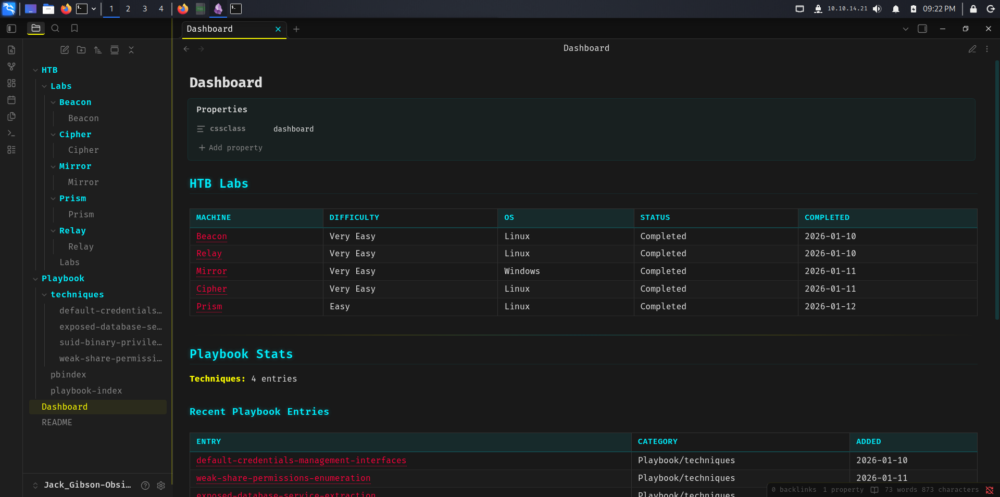
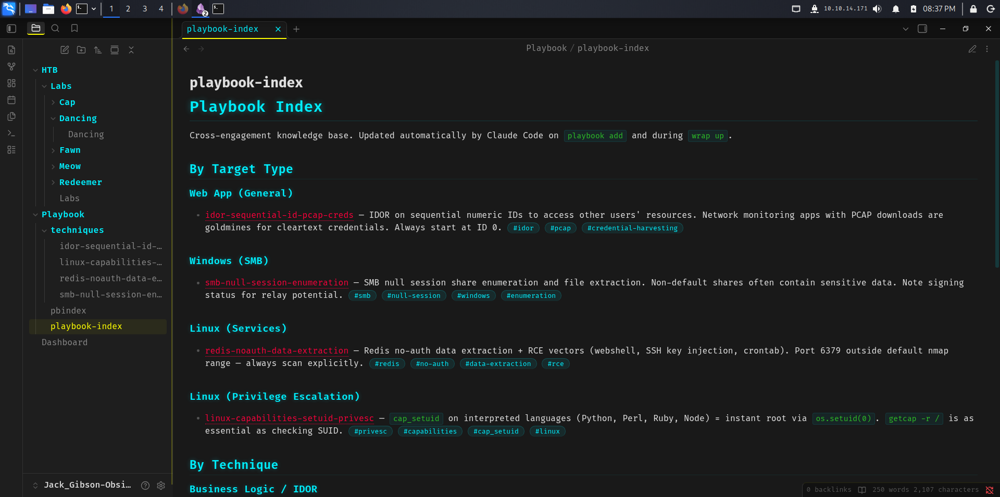
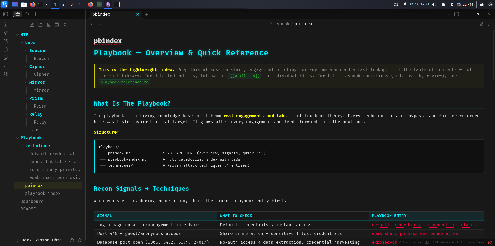
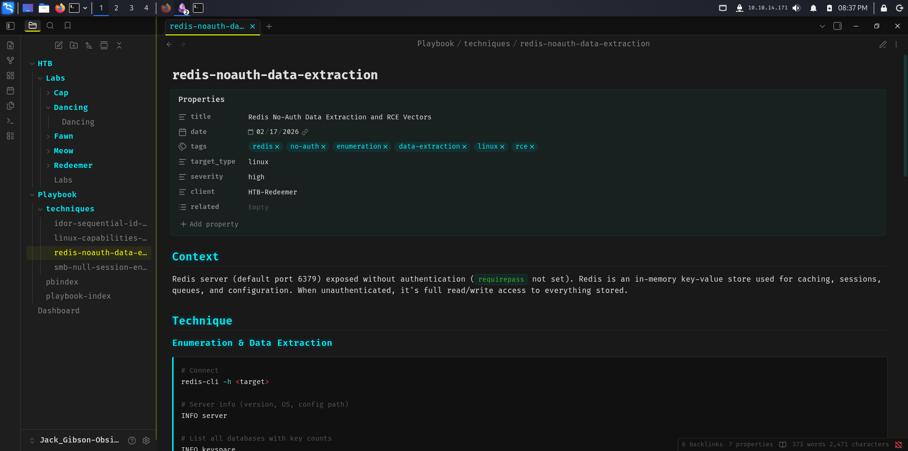
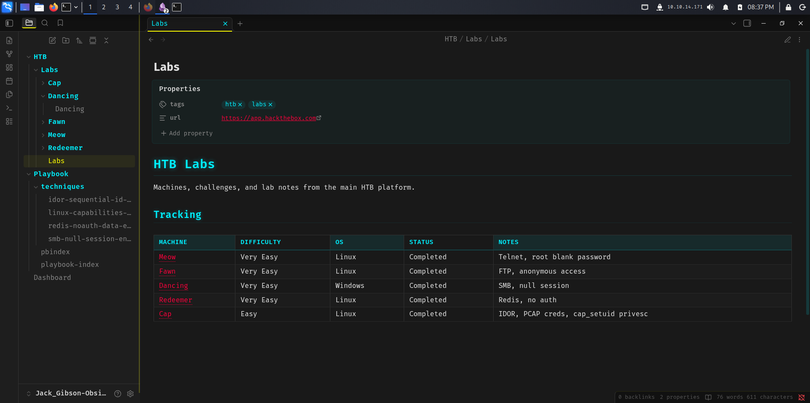
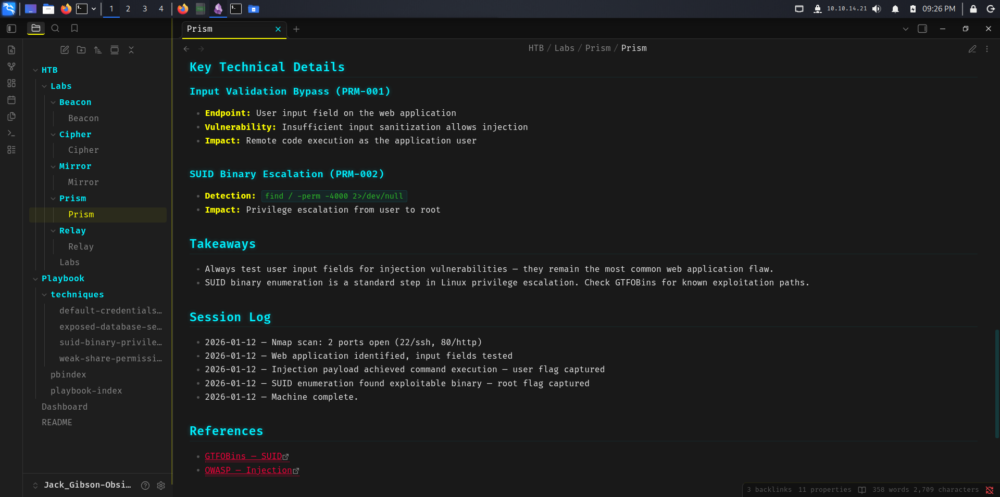

# Obsidian Theme - Jack Gibson

Obsidian theme I use to track Hack The Box (HTB) labs. It contains some demo lab data and playbook info.

**Creator:** gn057h3x

## Screenshots

| | | |
|:---:|:---:|:---:|
|  |  |  |
|  |  |  |

## Setup

1. Clone this repo into your Obsidian vaults directory
2. Open the folder as a vault in Obsidian
3. Enable the `style` CSS snippet in **Settings > Appearance > CSS Snippets**
4. Optionally place a `background.jpg` in `.obsidian/snippets/` for the background image

## Structure

```
HTB/Labs/          - Machine walkthroughs (5 retired demos)
Playbook/          - Techniques and knowledge base
Reports/Templates/ - Finding and report templates
Dashboard.md       - Main dashboard view
```

## Theme Features

- Dark terminal aesthetic with monospace fonts
- Cyan headings with glow effects
- Red accent links
- Yellow bold/italic highlights
- CRT scanline overlay
- Neon graph view styling
- Zero plugin dependencies
